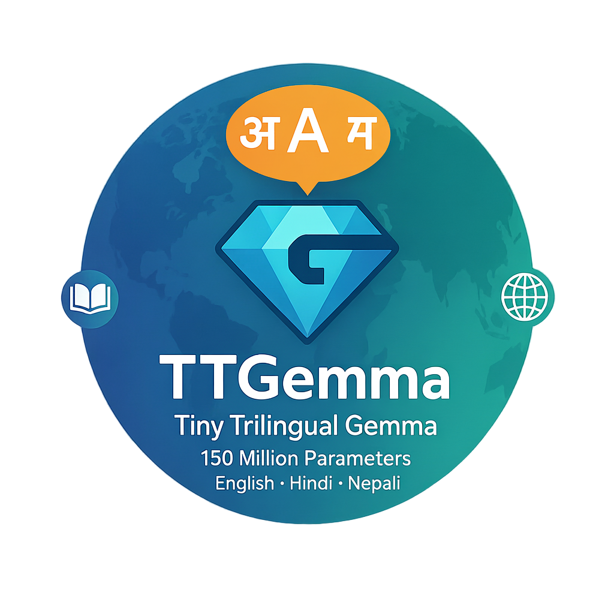

# TTGemma - Tiny Trilingual Gemma

<p align="center">
  
</p>


**TTGemma** is a multilingual autoregressive language model (~150M parameters) developed from scratch with a focus on English, Hindi, and Nepali. The project encompasses the complete lifecycle of language model development: from large-scale multilingual data collection and tokenizer training to distributed pretraining and parameter-efficient finetuning (PEFT) for downstream tasks.

---

## 🚀 Project Overview

* **Model Type:** Decoder-only Transformer (Gemma-style)
* **Languages Supported:** English, Hindi, Nepali
* **Parameters:** ~148M trainable parameters
* **Tokenizer:** SentencePiece Unigram (64k vocabulary, multilingual with Latin + Devanagari support)
* **Training Corpus:** ~3B tokens curated across Wikipedia, OSCAR, Common Crawl, and other sources

---

## 📦 Repository Structure

```
TTGemma/
│
├── training_scripts/        # Pretraining scripts (multi-GPU, Distributed)
├── tokenizer/               # SentencePiece tokenizer (.model file + training script)
├── finetuning_recipies/              # LoRA finetuning examples
└── README.md                # Project documentation
```

---

## 🔑 Key Features

### Pretraining

* **Architecture:**

  * Decoder-only Transformer with RMSNorm, Rotary Position Embeddings (RoPE), and SwiGLU activation.
  * Config: *d_model=640, n_layers=16, n_heads=10*.

* **Efficiency & Scaling:**

  * Distributed Data Parallel (DDP) across 4 GPUs.
  * Large batch simulation with gradient accumulation (global batch size = 512).
  * Sharded memory-mapped datasets with efficient `PackedLangCycler` for streaming, overcoming IO Bottleneck.

* **Optimization:**

  * **Optimizer:** AdamW (weight decay = 0.05).
  * **Scheduler:** Cosine annealing with 1500-step warmup.
  * **Checkpointing:** Robust save/resume functionality (model, optimizer, RNG, scaler states).

---

### Tokenizer

* **Model:** SentencePiece Unigram (64k vocab).
* **Coverage:** Balanced across EN, HI, and NE, with support for both Latin and Devanagari scripts.
* **Special Tokens:**

  * Language tags: `<eng>`, `<hin>`, `<nep>`
  * Sequence tokens: `<s>`, `</s>`, `<pad>`, `<unk>`

This ensures robust multilingual handling and better generalization.

---

### Finetuning (PEFT)

* **Approach:** LoRA adapters (<1% of total parameters trainable).
* **Advantages:** Avoids catastrophic forgetting, low compute/memory overhead, easy portability.
* **Example Provided:**

  * *Clickbait Detection* (binary classification, EN + HI).
  * Small dataset included.
  * Example script demonstrates end-to-end LoRA integration.

Future-proof design supports adding more tasks via adapter modules.

---

## 📊 Evaluation

### Pretraining (Perplexity on validation set)

| Language | Loss (Nats) | PPL   | BPT  | Accuracy |
| -------- | ----------- | ----- | ---- | -------- |
| English  | 3.89        | 49.15 | 5.62 | 36.9%    |
| Hindi    | 3.62        | 37.55 | 5.23 | 38.2%    |
| Nepali   | 4.12        | 61.37 | 5.94 | 32.9%    |

### Finetuning
A script is available, demonstrating finetuning the pretrained model for downstream tasks (in this case, trilingual clickbait detection)
* **Clickbait Detection:** Correctly identifies sensationalized headlines across languages.
* **Knowledge Graph → Text:** Generates coherent sentences from structured triples (English + Hindi).

#### ✅ Pretrained model best checkpoint: https://drive.google.com/file/d/1-GcEja3Au9OTv3-F26fvHvvz9W7GQxO2/view?usp=drive_link

--- 

## References:

Preprocessing steps followed: Thakur, Aamod, et al. "The Art of Breaking Words: Rethinking Multilingual Tokenizer Design." arXiv preprint arXiv:2508.06533 (2025).

Gemma Architecture: Team, Gemma, et al. "Gemma 3 technical report." arXiv preprint arXiv:2503.19786 (2025).

AI4Bharat Web Corpus: huggingface.co/datasets/ai4bharat/sangraha/


